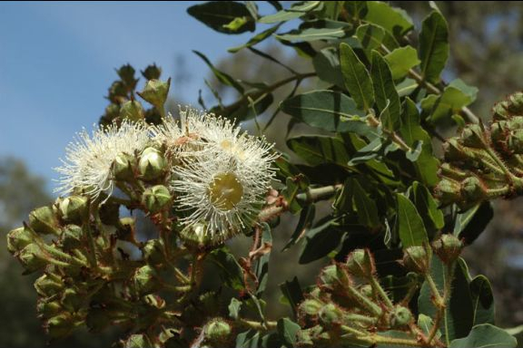
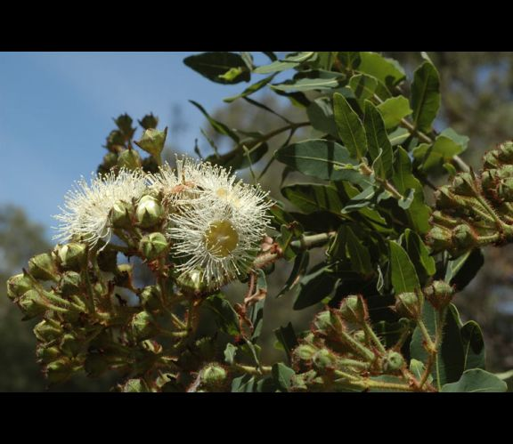

## Background
This *R*-package contains utility functions to easily and consistently perform several important
tasks required to prepare data for uploading to the R&R Webtool GitLab repositories. The R&R Webtool Maintenance Manual
gives full documentation of the design of the webtool, and describes how each data element for a webtool taxon is
prepared. Please consult that document for both an overview and precise details of tasks to be performed by each
function in this package.

> A copy of the R&R Webtool Maintenance Manual is always available on the N-drive here:
>   N:\\Evolutionary Ecology\\Restore & Renew\\Webtool R&R\\Documentation

The functions and associated tasks included in this package are listed in the table below. See the section for each function later in this document for a detailed description of the function and examples of its use.

Function         |   Task(s)
-----------------|-------------------------------------------
formatInfoImages | Scale and/or crop jpg-format images for the species information section
showModelCovars  | Show the current GDM model covariates and paths to covariate data files
setModelCovars   | Set GDM model covariate paths to structure used on the device hosting the R&R webtool *R*-package. GDM model threshold may also be set to a new value
update_occFiles  | Update filtered ALA herbarium data files for a set of taxa
makeOccPlot      | Make leaflet maps as png images showing filtered ALA herbarium record distribution for a set of taxa
makeBRECIplots   | Generate png files of BRECI plots for a set of taxa
trim_GDM_domain  | Trim an R&R GDM model domain polygon using special zone information

## The functions

### formatInfoImages
The species information section of the webtool provides the a set of images highlighting important species characteristics. A set of images for each taxon needs to be sourced in JPEG format as described the R&R Webtool Maintenance Manual and in ?????. Collated images are stored on the N-drive in the folder ???? but in their original state covers a wide spectrum of image sizes and aspect ratios. This function will process a set of jpg files in the source folder and output a set of jpg images with consistent target height and width dimensions specified in the script which renders an output html document for an end user of the R&R Webtool. Proicessed images are written to the specified destination folder.

The target height of output images is 500 pixels and target width is 576 pixels giving a target aspect ratio of 1.152. The algorithm developed to perform the rescaling ensures that the original aspect ratio is conserved to avoid distortion. This may result in a image area embedded within the the target image frame. If this occurs, the background is set to black to pad the re-sized image centering it within the target frame.

An example may make this clearer. The first image shows the original format has height of 499 pixels and width of 750 pixels, and therefore an aspect ratio of 1.503006. To fit the target image frame but maintain the original aspect ratio to avoid distortion, we end up with a height of 384 pixels and a width of 576 pixels (second image). So the re-scaled image is padded symmetrically so the shortest dimension matches the target image frame (see third image).






Small images (those with height and/or width less than the target dimensions) are some times encountered. No rescaling of small images (to avoid image quality loss) is performed, only padding on height and width to fill the target image frame.


### showModelCovars
During the process of setting up a new batch of taxa for uploading to the webtool *data* repository it is necessary to review the list of covariates required by the GDM models for the set of species. This can be done species by species by using the *load()*. However, this is very laborious with more than a few species, so this function allows the user to list important information for a given GDM model object produced by Jason Bragg's toolkit. The model takes as its only parameter the full path to an R&R GDM model object and outputs a formatted object content summary.

The function is designed to be called with the full path to a single R&R GDM object file. The R&R GDM object for *Hakea teretifolia* is called "Hakea_teretifolia_genetic_model.Rd". If you wish to examine the model and it is currently stored in the folder "C:\\Stuff\\GDM", then you might call the function in the this way:

```{r eval=FALSE}
fileName <- "C:\\Stuff\\GDM\\Hakea_teretifolia_genetic_model.Rd"
showModelCovars(fileName)
```

### setModelCovars
The R&R webtool allows the use of two types of covariate files: Environmental covariates, and ancestry coefficients (Q-files). When an R&R GDM object is produced by Jason's *R*-functions, paths to covariate rasters are saved which are relevant to his development environment. This function performs a few important refinements to the R&R GDM model contents to enable it to be used in the *production* environment found on the web-server hosting the *R* session supporting the webtool.

In particular, paths to environmental covariates and ancestry proportion coefficient files (Q-files) must be set to access a file structure which differs from the model buidling or devlopment environment. This function looks at the covariates listed for the fitted GDM model, confirms that the matching covariate files are present in the necessary location, and then sets the necessary elements of the model object to load **raster stacks** of covariates from the appropriate folders found on the server, namely:

* Environmental covariates filenames are prefixed with /home/RandR/envData with sub-folders for geographically-defined extents. At present, the only sub-folder used is "eastOZ".
* Q-file covariates filenames are prefixed with /home/RandR/qData, and there is also, at present, only one sub-folder 'eastOZ'.


An additional parameter was add to allow a call to this function to change the threshold value stored in Jason's R&R GDM object. The default value for the paramater is NULL which leaves the current value of threshold unchanged. Calling the function with a value between 0 and 1 will set the threshold to this new value. The reason for permitting the change of threhold was the decision to shift the defualt threshold from 0.3 to 0.2 for GDMs except that for *Acacia suaveolens*.

A new value for the threshold applied to the GIS raster output by the model to create the "local" genetic region or provenance can be set by passing a new value in the parameter *threshold*. Threshold values must be between 0 and 1; a value passed into the function outside this range causes the function to stop. The default value of NULL leaves the threshold value unchanged.

The updated model object is then saved over the original model object. **For safety, it is recommended that a copy is archived in a folder not used by this function.**


### update_occFiles
The function updates the set of herbarium occurrence files for the full set of taxa 

### makeOccPlot


### makeBRECIplots


### trim_GDM_domain


